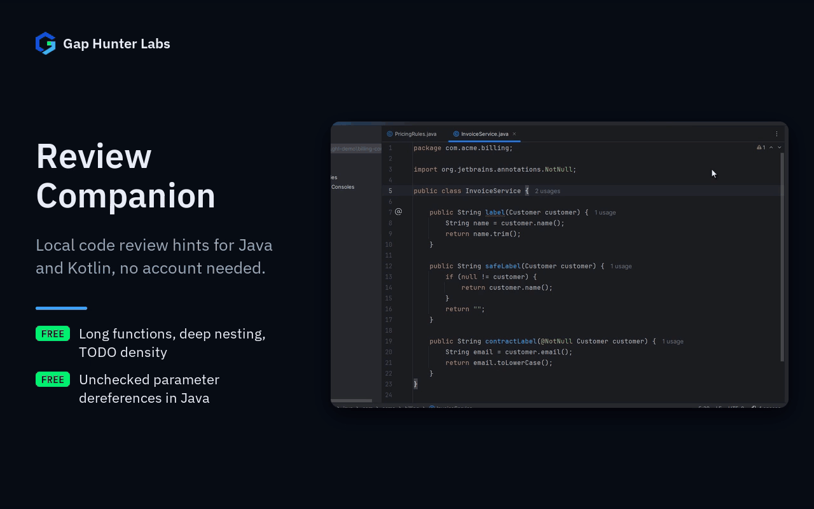

# Review Companion

IntelliJ-family plugin. Local, rule-based code review hints for Java and
Kotlin — no account, no rate limit, no cloud call.



Each feature on its own:
[Null checks](docs/media/01-null-check.gif) ·
[Deep nesting](docs/media/02-nesting.gif)

## Why it exists

Born from real evidence in JetBrains Marketplace reviews of Bito AI Code
Reviews (~864K downloads, freemium), not assumptions:

- "Only 20 request per day for paid plan?" — rate-limited even on a plan
  users already pay for.
- "DO NOT SUBSCRIBE! There is nothing free here, then you cannot close
  your account." — billing and cancellation friction.
- "It keeps asking for verification... It keeps sending a code." —
  broken auth flow blocking use entirely.

## Why built this way

- **No account, ever.** The direct, structural fix for every complaint
  above: there's nothing to subscribe to, rate-limit, or authenticate
  against. Every check runs locally, against the code already open in
  the editor.
- **Reuses the exact architecture already proven in API Security
  Companion** (pure-Kotlin detection logic in `detect/`, fully separated
  from PSI-walking code in `psi/`; every rule a real `Annotator`
  scheduled on the platform's own background highlighting pass, never
  blocking) — a different rule domain (general review hygiene, not
  security), same discipline.
- **`NULL_DEREFERENCE` is deliberately narrow and Java-only.** It only
  flags a method parameter dereferenced with no preceding null-check
  guard anywhere earlier in the same function — no dataflow analysis, no
  attempt at exhaustive nullability inference. A review tool that cries
  wolf on things that aren't real bugs is itself a trust problem, so
  this favors missing real issues over false positives. A guard is
  `x != null` / `x == null` in either order (`null != x` too),
  `instanceof`, or `Objects.requireNonNull(x)`. A parameter declared
  non-null — `@NotNull`, `@NonNull` or `@Nonnull` from any package
  (JetBrains, Jakarta, javax, Lombok, Spring...) — or of a primitive
  type is never reported. (Before 0.2.2 the reversed `null != x` check
  and the annotations were ignored, so those dereferences were
  reported.) Kotlin isn't
  covered by this specific rule since its own null-safety type system
  already prevents the bug class it targets for non-platform types.
- **Every rule independently toggleable and threshold-configurable**,
  none paywalled — no evidence in this space justifies a paid tier the
  way it did for Ansible Companion's FQCN completion.

## Usage

Open any Java or Kotlin file — findings appear as weak warnings on the
relevant function's name, as part of the editor's normal highlighting
pass. Adjust thresholds or disable individual rules under Settings >
Tools > Review Companion.

## Support

- **Bugs and feature requests:** [GitHub Issues](https://github.com/GapHunterLabs/review-companion/issues)
- **Questions, or custom rules for a team's codebase:** **gaphunterlabs@gmail.com**
- **Security vulnerabilities:** report privately as described in [SECURITY.md](SECURITY.md), not in a public issue.
- **Privacy and network behavior:** [PRIVACY.md](PRIVACY.md)

## Development

```
./gradlew test           # unit tests
./gradlew buildPlugin    # generates build/distributions/*.zip
./gradlew verifyPlugin   # checks compatibility against real IDEs
```

`demo/` has realistic Java (`OrderProcessor.java`) and Kotlin
(`InventoryService.kt`) sources with one deliberate instance of each
rule, plus a clean file (`ReportGenerator.java`) confirming no false
positives on reasonable code.

## License

Apache-2.0. See `LICENSE`.
